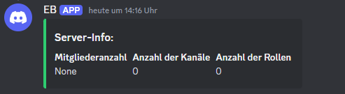
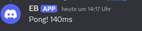
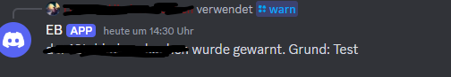
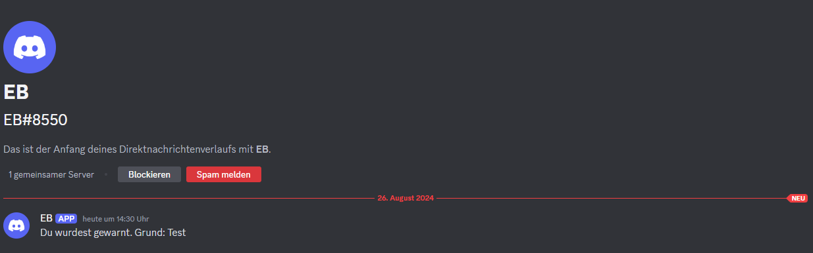

Insert your Bot Token before running the code.

## Installation
1. Install the dependencies:

    ``pip install discord``  
    ``pip install aiohttp``  
    ``pip install requests``  
    ``pip install python-dotenv``  
 
2. Insert your bot token into the `mod_bot.py` file:   
    TOKEN = 'YOUR_BOT_TOKEN'
  
3. Start the bot:
    ``
    python mod_bot.py
    ``

## Commands

- **/kick**: Kick a member from the server
    - **Parameters**:
        - `member`: The member to be kicked
        - `reason`: The reason for kicking

- **/ban**: Ban a member from the server
    - **Parameters**:
        - `member`: The member to be banned
        - `reason`: The reason for banning

- **/unban**: Unban a user
    - **Parameters**:
        - `member`: The member to be unbanned

- **/zahlenraten**: Play a number guessing game

- **/ping**: Shows the bot's latency

- **/warn**: Warn a member about their behavior
    - **Parameters**:
        - `member`: The member to be warned
        - `reason`: The reason for the warning

- **/serverinfo**: Shows information about the server

 

Preview:  
  
  
  
  
